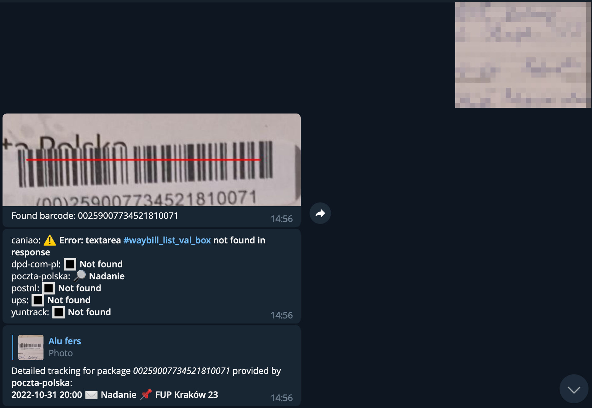

# paczkobot

A Telegram bot for tracking packages.

See it in action: [@paczko_bot](https://t.me/paczko_bot)

## Features
- [x] Track packages from these providers
  - [x] dhl (requires API key)
  - [x] ups 
  - [x] dpd.com.pl
  - [x] poczta-polska
  - [x] postnl
  - [x] Inpost
  - [x] gls
- Follow packages and send notifications when a package status changes
- Generate QR codes for InPost Paczkomaty
- Automatically import packages from InPost Paczkomaty
- Remotely open InPost Paczkomaty
- Detect package barcodes in images


## Screenshots



## Usage

On first run the bot will create a file called `paczkobot.yaml` looking like this:

```yaml
telegram:
  debug: false
  username: paczko_bot
  token: "<telegram api key>"
db:
  type: sqlite # or postgres
  filename: paczkobot_dev.db # for sqlite
  dsn: "host=localhost user=gorm password=gorm dbname=gorm port=9920 sslmode=disable TimeZone=Europe/Warsaw" # for postgres
tracking:
  providers:
    dhl:
      enable: false # register on the dhl developers webpage to enable
      api_key: "<dhl api key>"
    mock:
      enable: false
  automatic_tracking_check_interval: 20m0s
  automatic_tracking_check_jitter: 7m0s
  delay_between_packages_in_automatic_tracking: 1m0s
  max_packages_per_automatic_tracking_check: 15
  max_time_without_change: 336h0m0s

```

You have to enter your telegram token there.
